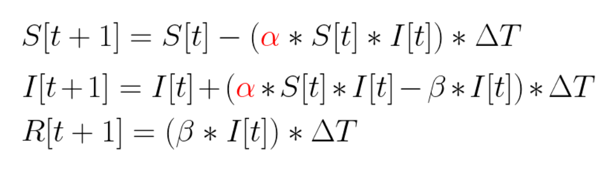
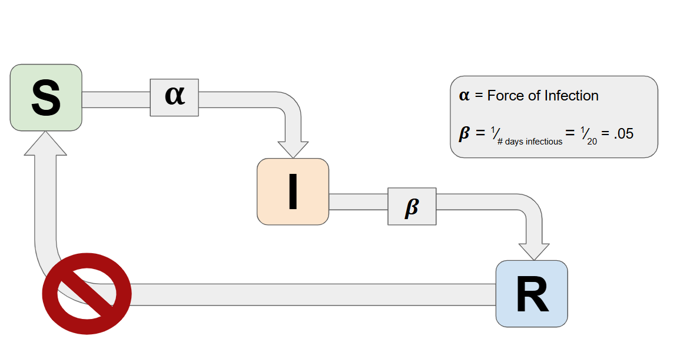
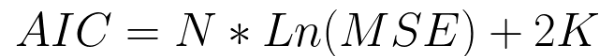
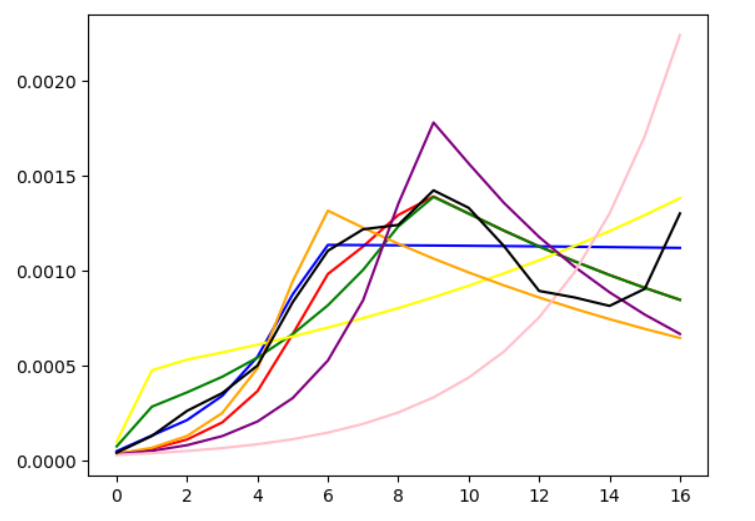

# North Dakota COVID-19 Response Analysis and SIR Model

## Overview  
This project models North Dakota’s unsucessful response to the COVID-19 pandemic using the **Susceptible, Infectious, Recovered (SIR)** model. It applies optimization techniques to predict and quantify the effects of key public health measures and determine which of these government implemented policies had the greatest impact on the states' failed recovery.

## Features  
- **Central Censoring**: Computes weekly averages to simplify analysis and remove innacurate optimization due to small rises and dips within the data.
- **SIR Model Implementation**: Tracks the dynamics of **susceptible**, **infectious**, and **recovered** populations over time using differential equations. 
- **Optimization**: Iteratively tests different transmission rate values from 0.01 to 1.00 to estimate the optimal transmission rate for the model based on the minimum residual sum of squares between the real data and the model data.
- **Akaike Information Criterion (AIC)**: Statistical method that calculates the AIC score between the model and real data to determine which model is the best fit for the real data.
- **Visualization**: Generates graphical results of the infectious population for both the model and real data to visually compare the models to the real data.
  

## SIR Model Overview  

This project utilizes the **Susceptible-Infectious-Recovered (SIR)** model to simulate the spread of COVID-19. The SIR model divides the population into three groups:  
1. **Susceptible (S)**: Individuals who are at risk of infection.  
2. **Infectious (I)**: Individuals who have been infected and can transmit the disease.  
3. **Recovered (R)**: Individuals who have recovered and can no longer be infectious.
   
The dynamics of the model are reprsented by the following differential equations:  
  

Variables:  
- \(S\): The susceptible population.  
- \(I\): The infectious population. 
- \(R\): The recovered population.  
- \(alpha\): The **force of infection**, representing the transmission rate of the viral disease.
- \(beta\): The recovery rate.  
- \(delta T\): The time interval.  

The model flow is visualized in the diagram below:  
  

### Key Insights:  
- **Force of Infection (alpha)**: Influenced by public health policies such as mask mandates, social distancing, and building closures which impact the transmission rate of the disease.  
- **Recovery Rate (beta)**: Depends on the average duration of infectiousness. For COVID-19, the average duration of infectiousness is 20 days so the beta value for this model is 0.05
- **S->R**: This model does not consider individuals moving from the recovered population to the susceptible population since this factor is dependant on the individuals' natural immunity which can last anywhere from 3 months to 6 months depending on factors like the invididuals' age and health.
- **Time Interval (delta T\)**: This model runs a time interval of 120 days which covers the inital 120 days of the COVID-19 pandemic in North-Dakota and cuts off the model at the beginning where natural immunity is lost.
  

## North Dakota Government Response 

This analysis is for the first 120 days of the North Dakota COVID-19 pandemic from March 19th, 2020 to July 17th, 2020.

### Government Public Health Policies  
This analysis evaluates the impact of the three most important public health policies implemented by the government during North Dakota's COVID-19 response:  

1. **Closing of Businesses**:
   - Implemented on March 27th, 2020 (day 8).
   - A very late introduced lockdown.
3. **Reopening of Buildings**:
   - Implemented on May 1st, 2020 (day 42).
   - A very early repeal of the lockdown. 
5. **North Dakota's "Smart Restart"**:  
   - Implemented on May 22nd, 2020 (day 64).
   - North Dakota's attempt to return life to how it was pre-pandemic.

Other government policies were introduced such as a mask mandate and social distancing requirements but were ineffective due to a lack of compliance from North Dakota residents..  

## Results

#### Real Data

The real number of reported COVID-19 infections in North Dakota for each day in the 120 day interval is provided by the North Dakota government records. This data can be viewed in the attatched csv file. The real data will be used as a control to compare each of the models to determine which policies had the greatest impact.

#### Models

This simulation will consider 7 models that feature either none, one or two policies. The 7 models include:

1. Policies of reopening of buildings and North Dakota's "Smart Restart"
2. Policies of business closure and reopening of buildings
3. Policies of business closure and North Dakota's "Smart Restart"
4. Policy of business closure
5. Policy of reopening of buildings
6. Policy of North Dakota's "Smart Restart"
7. No policy enacted

Note: The current state of this simulation can only handle SIR models up to two policies in its current state.

#### Optimized Alpha Values

Depending on how many policies the SIR model has, the number of optimized alpha values range from 1-3. The optimized alpha values for each model are:

1. a = 0.14, 0.07, 0.04
2. a = 0.26, 0.12, 0.05
3. a = 0.4, 0.08, 0.04
4. a = 0.5, 0.06
5. a = 0.15, 0.04
6. a = 0.12, 0.03
7. a = 0.09

#### AIC Scores

Akaike Information Criterion (AIC) is a statistical method of comparing models based on the formula:

Models with the lowest AIC score when compared to the real number of infections is the best fit for the real data. The AIC score for each model is:

1. -290.3249100773184
2. -290.4597645999022 
3. -287.69635591778695
4. -269.2089588195404 
5. -281.33360010294723 
6. -270.11373051489846 
7. -245.9078108177268

The model with the lowest AIC score is model 2, indicating that model 2 is the best fit for the real data.

#### Graphical Analysis

The graphical analysis omits the susceptible and recovered graphs to better show a comparison between the infectious populations with each model to the real data.

Legend:
- x-axis: week number
- y-axis: proportion of individuals infectious
- Red: Model 1
- Blue: Model 2
- Green: Model 3
- Yellow: Model 4
- Orange: Model 5
- Purple: Model 6
- Pink: Model 7
- Black: real number of infectious individuals

As seen from the graphical analysis, model 2 is the best fit for the real data.

## Implications

Since model 2 is the best fit for the real data, the policies of business closure and reopening of buildings had the greatest negative impact on North Dakota's unsuccessful response to the COIVD-19 pandemic. This project is helpful since it shows that if there were to be another pandemic due to another viral disease, the closing of businesses and reopening of buildings within a similar timeframe that North Dakota implemented these policies will lead to a similar failed response.

This result more importantly highlights the importance of timing in implementing public health policies in controlling viral diseases.
